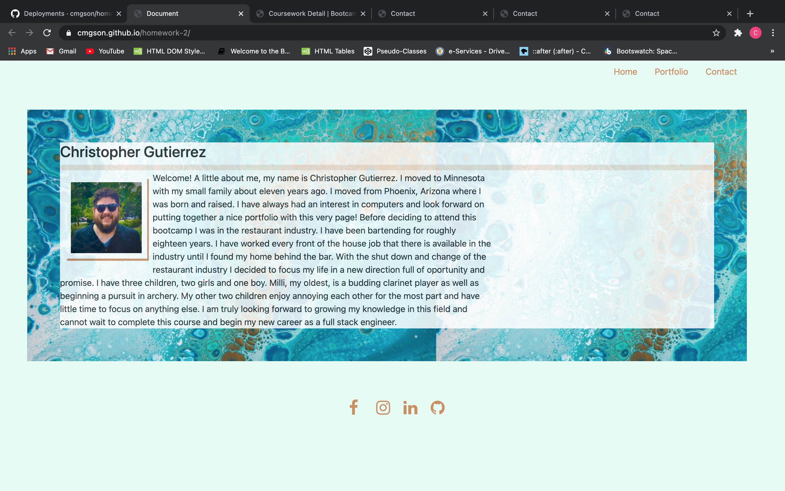

# **Homework unit two- using html, css, and bootstrap to build a portfolio website** #

## *Home Page*

Using HTML CSS and Bootstrap I was able to make everything viewable from any size window.  It should flow very easily no matter the viewport wether viewing from a desktop or a cell phone.  I had a little trouble with sizing and making sure everything was fitting together and not overflowing when switching from a large viewing size to smaller.
The nav bar took some doing.  I borrowed the code from getbootstrap.com and then fixed the pathes to navigate to the two other pages as designed.  I didnt mess with this section that much as I didnt want to interfere with its functionality which was easy to do with bootstrap using it for the first time.
I used the jumbotron class in order to position my name on the lead page.  The container has an id of colorchange which is styled on the accompanied style sheet.  I wanted to create a style sheet with a common theme in order to ensure that every page looked related with the backgrounds fonts and colors.
Within the img class I used a bootstrap class called textwrap in order to wrap the bio around my headshot.
I utilized the wireframe on bootstrap in order to size up and down but to also position the container evenly within the body of the page.  The empty div tag at the end was used simply for negative space.
Finally I added a footer with all social media logos in the same color scheme.

## *Portfolio*

Within the portfolio page I borrowed the nav bar from the index page.  As for the placeholders, I placed them in one column taking up 2/3 of the page and an empty col 4 in order to add some negative space.  Not much to see here yet once I have some projects they will land here with cover art and clickable links.

## *Contact*

The contact form is from bootstrap as well I didnt alter it much as it is a pretty complex addition with a lot of classes.  I just removed the placeholder text from the message.

## *Stylesheet*

I tried to group classes and ids together to make it easier to compare and figure out which elements are used on each HTML.  In order to style the footer without any interference from the rest of the style sheets I had to designate it with !important.  This is the first time I have created any of these elements from scratch and it was pretty tough trying to group them.  I am not sure if this is a *best practice* or not but it made sense and makes it easier for me to follow at least.

Here is the deployed site!

https://cmgson.github.io/Portfolio/

